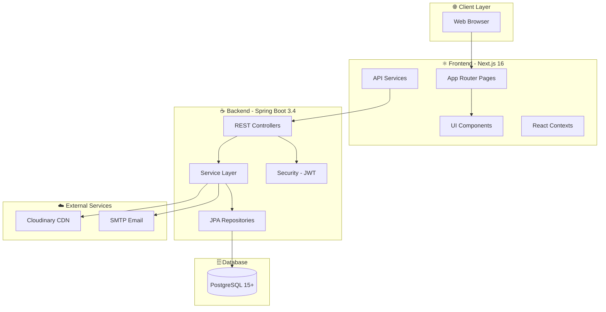
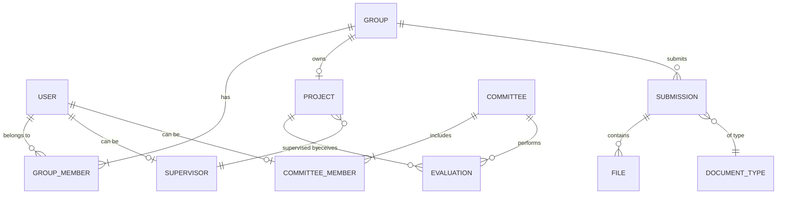
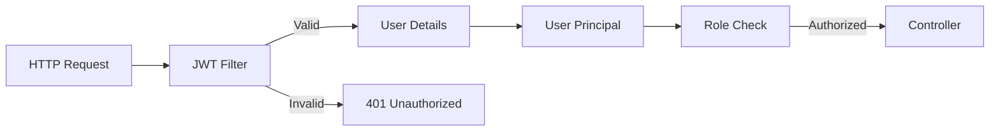
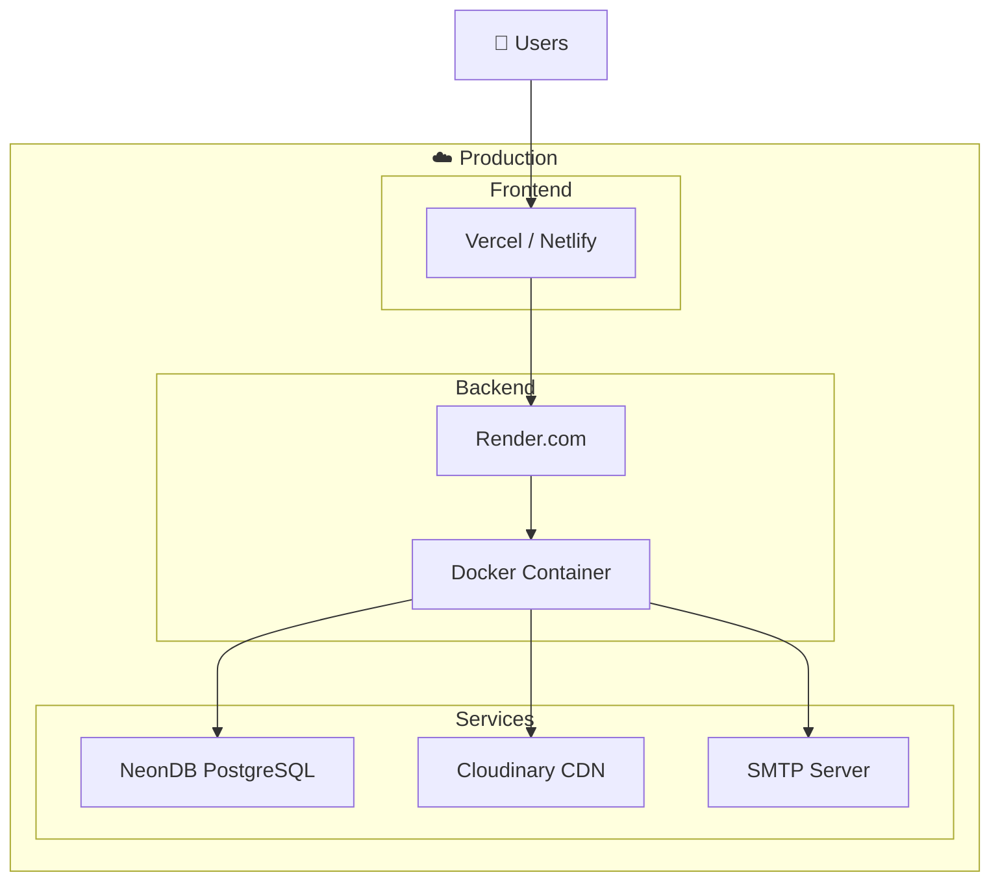

<p align="center">
  
</p>

<p align="center">
  <em>🎓 A Modern Final Year Project Management System</em>
</p>

<p align="center">
  
  
  
  
  
  
</p>

<p align="center">
  
  
  
</p>

---

## 📋 Table of Contents

- [Overview](#-overview)
- [Features](#-features)
- [Architecture](#-architecture)
- [Tech Stack](#-tech-stack)
- [Project Structure](#-project-structure)
- [Getting Started](#-getting-started)
- [API Documentation](#-api-documentation)
- [Design Patterns](#-design-patterns)
- [Deployment](#-deployment)
- [Screenshots](#-screenshots)
- [Team](#-team)
- [Documentation](#-documentation)

---

## 🎯 Overview

**FYPify** is a comprehensive web-based platform designed to streamline and automate the entire Final Year Project (FYP) lifecycle in universities. It provides a centralized solution for managing student projects, supervisor assignments, committee evaluations, and document submissions.

### Problem Statement

| Challenge | Description |
|-----------|-------------|
| 📄 **Manual Processes** | Paper-based submissions and fragmented communication |
| 🔍 **Lack of Transparency** | Students unaware of evaluation criteria or project status |
| 📅 **Coordination Issues** | Difficulty scheduling evaluations and managing committees |
| 📁 **Document Management** | Lost submissions, version control issues, deadline tracking |
| ⚖️ **Evaluation Inconsistency** | No standardized rubrics or evaluation history |

### Solution

FYPify solves these challenges with:

- ✅ **Role-Based Access Control** — Dedicated portals for all stakeholders
- ✅ **Automated Workflows** — Streamlined submission and evaluation processes
- ✅ **Real-Time Notifications** — WebSocket-powered instant updates
- ✅ **Cloud Document Storage** — Cloudinary integration with version tracking
- ✅ **Structured Evaluations** — Draft/finalize system with scoring rubrics

---

## ✨ Features

<table>
<tr>
<td width="50%">

### 👨‍🎓 For Students
- Create and join project groups
- Submit project proposals
- Upload documents (reports, code, presentations)
- View evaluation results and feedback
- Track submission deadlines

</td>
<td width="50%">

### 👨‍🏫 For Supervisors
- Review and approve student groups
- Manage assigned projects
- Evaluate student submissions
- Provide feedback on proposals

</td>
</tr>
<tr>
<td width="50%">

### 📋 For Committee Members
- Evaluate assigned projects
- Score based on evaluation criteria
- Draft and finalize evaluations
- Access project documents and history

</td>
<td width="50%">

### 👑 For Administrators
- Manage users and roles
- Configure system settings
- Create evaluation committees
- Define document types and deadlines
- Generate reports and audit logs

</td>
</tr>
</table>

---

## 🏗️ Architecture

### High-Level System Architecture



### Database Entity Relationships



### Security Architecture



---

## 🛠️ Tech Stack

### Backend

| Technology | Version | Purpose |
|------------|---------|---------|
| **Java** | 21 (LTS) | Primary programming language |
| **Spring Boot** | 3.4.0 | Application framework |
| **Spring Security** | 6.x | Authentication & authorization |
| **Spring Data JPA** | 3.x | Database ORM with Hibernate |
| **PostgreSQL** | 15+ | Relational database |
| **JWT (JJWT)** | 0.12.6 | Stateless token authentication |
| **Flyway** | Latest | Database migrations |
| **Cloudinary** | 1.39.0 | Cloud file storage |
| **MapStruct** | 1.5.5 | DTO mapping |
| **Lombok** | Latest | Boilerplate reduction |
| **Maven** | 3.9+ | Build automation |
| **Docker** | Latest | Containerization |

### Frontend

| Technology | Version | Purpose |
|------------|---------|---------|
| **Next.js** | 16.0.7 | React framework (App Router) |
| **React** | 19.2.1 | UI library |
| **TypeScript** | 5.x | Type-safe JavaScript |
| **TailwindCSS** | 4.x | Utility-first CSS |
| **shadcn/ui** | Latest | UI component library |
| **TanStack Query** | 5.90.12 | Server state management |
| **TanStack Table** | 8.21.3 | Data tables |
| **React Hook Form** | 7.68.0 | Form handling |
| **Zod** | 4.1.13 | Schema validation |
| **Axios** | 1.13.2 | HTTP client |
| **Recharts** | 2.15.4 | Charts and analytics |

### Cloud Services

| Service | Purpose |
|---------|---------|
| **Cloudinary** | Document uploads, CDN delivery, image optimization |
| **SMTP** | Email notifications (Gmail, SendGrid compatible) |
| **NeonDB** | Serverless PostgreSQL (production) |

---

## 📁 Project Structure

```
FYPify/
├── backend/                          # Spring Boot Backend
│   ├── src/main/java/com/fypify/backend/
│   │   ├── BackendApplication.java   # Entry point
│   │   ├── config/                   # Configuration classes
│   │   │   ├── SecurityConfig.java
│   │   │   ├── CloudinaryConfig.java
│   │   │   └── WebSocketConfig.java
│   │   ├── security/                 # JWT & Security
│   │   │   ├── jwt/
│   │   │   └── CustomUserDetailsService.java
│   │   ├── common/                   # Shared utilities
│   │   │   ├── exception/            # Global exception handling
│   │   │   └── response/             # API response DTOs
│   │   └── modules/                  # Feature modules
│   │       ├── admin/
│   │       ├── auth/
│   │       ├── committee/
│   │       ├── evaluation/
│   │       ├── file/
│   │       ├── group/
│   │       ├── notification/
│   │       ├── project/
│   │       ├── submission/
│   │       └── user/
│   ├── src/main/resources/
│   │   ├── application.yml
│   │   ├── db/migration/             # Flyway migrations
│   │   └── templates/                # Email templates
│   ├── Dockerfile
│   └── pom.xml
│
├── frontend/                         # Next.js Frontend
│   ├── app/                          # App Router pages
│   │   ├── admin/                    # Admin portal
│   │   ├── student/                  # Student portal
│   │   ├── supervisor/               # Supervisor portal
│   │   ├── committee/                # Committee portal
│   │   ├── login/
│   │   └── register/
│   ├── components/                   # Reusable components
│   │   ├── ui/                       # shadcn/ui components
│   │   ├── layout/
│   │   └── project/
│   ├── contexts/                     # React contexts
│   ├── shared/
│   │   ├── services/                 # API service functions
│   │   ├── hooks/                    # Custom React hooks
│   │   └── types/                    # TypeScript types
│   ├── providers/
│   └── package.json
│
├── architecture_diagram.md           # Detailed architecture docs
├── design_patterns.md                # GoF patterns documentation
├── introduction.md                   # Project introduction
└── TOOLS_AND_TECHNOLOGIES.md         # Complete tech stack details
```

---

## 🚀 Getting Started

### Prerequisites

- **Java 21** or later
- **Node.js 18+** and npm
- **PostgreSQL 15+** (or NeonDB account)
- **Maven 3.9+**
- **Git**

### 1. Clone the Repository

```bash
git clone https://github.com/Ahad-dev/fypify.git
cd fypify
```

### 2. Backend Setup

```bash
# Navigate to backend directory
cd backend

# Copy environment variables
cp .env.example .env

# Edit .env with your configuration
# - NEON_HOST, NEON_DATABASE, NEON_USERNAME, NEON_PASSWORD
# - JWT_SECRET
# - Cloudinary credentials
# - SMTP settings

# Install dependencies and build
mvn clean install

# Run the application
mvn spring-boot:run
```

The backend will start at `http://localhost:8081`

### 3. Frontend Setup

```bash
# Navigate to frontend directory
cd frontend

# Install dependencies
npm install

# Create environment file
cp .env.example .env.local

# Edit .env.local
# NEXT_PUBLIC_API_URL=http://localhost:8081

# Run development server
npm run dev
```

The frontend will start at `http://localhost:3000`

### 4. Docker Setup (Optional)

```bash
# Build and run backend container
cd backend
docker build -t fypify-backend .
docker run -p 8081:8081 --env-file .env fypify-backend
```

---

## 📚 API Documentation

Once the backend is running, access the interactive API documentation:

- **Swagger UI**: `http://localhost:8081/swagger-ui.html`
- **OpenAPI JSON**: `http://localhost:8081/v3/api-docs`

### API Endpoints Overview

| Module | Base Path | Description |
|--------|-----------|-------------|
| Auth | `/api/v1/auth` | Login, register, password reset |
| Users | `/api/v1/users` | User management |
| Groups | `/api/v1/groups` | Student groups |
| Projects | `/api/v1/projects` | FYP projects |
| Submissions | `/api/v1/submissions` | Document submissions |
| Evaluations | `/api/v1/evaluations` | Project evaluations |
| Committees | `/api/v1/committees` | Evaluation committees |
| Files | `/api/v1/files` | File upload/download |
| Admin | `/api/v1/admin` | Admin operations |

---

## 🎨 Design Patterns

FYPify implements several **Gang of Four (GoF)** design patterns:

### Creational Patterns
| Pattern | Usage |
|---------|-------|
| **Singleton** | All `@Service`, `@Component` classes via Spring IoC |
| **Builder** | Entity creation, `ApiResponse` construction |
| **Factory Method** | `ApiResponse.success()`, `ApiResponse.error()` |

### Behavioral Patterns
| Pattern | Usage |
|---------|-------|
| **Chain of Responsibility** | Security filter chain, exception handlers |
| **Template Method** | `JwtAuthenticationFilter extends OncePerRequestFilter` |
| **Strategy** | Password encoding, authentication providers |

### Structural Patterns
| Pattern | Usage |
|---------|-------|
| **Adapter** | Converting exceptions to `ApiResponse` format |
| **Repository** | Spring Data JPA repositories |

### Architectural Patterns
| Pattern | Usage |
|---------|-------|
| **DTO** | Request/Response data transfer objects |
| **Layered Architecture** | Controller → Service → Repository |

> 📖 See [design_patterns.md](./design_patterns.md) for detailed explanations with code examples.

---

## 🌐 Deployment

### Production Architecture



### Deployment Platforms

| Component | Recommended Platform |
|-----------|---------------------|
| Frontend | Vercel, Netlify |
| Backend | Render, Railway, AWS |
| Database | NeonDB, Supabase, AWS RDS |
| Files | Cloudinary |

---

## 📸 Screenshots

> Add screenshots of your application here

---

## 👥 Team

**Course**: Software Construction & Development (SCD)  
**Semester**: 5th Semester  
**Session**: 2023

| Roll No | Name | Role |
|---------|------|------|
| 2023-SE-09 | Ahmed Javed | Developer |
| 2023-SE-22 | Hafiz Abdullah | Developer |
| 2023-SE-24 | Ahmed Raza | Developer |
| 2023-SE-31 | Muhammad Ahad | Developer |

---

## 📖 Documentation

| Document | Description |
|----------|-------------|
| [Introduction](./introduction.md) | Project overview and objectives |
| [Architecture Diagram](./architecture_diagram.md) | Detailed system architecture with Mermaid diagrams |
| [Design Patterns](./design_patterns.md) | GoF patterns implemented in the backend |
| [Tools & Technologies](./TOOLS_AND_TECHNOLOGIES.md) | Complete technology stack |

---

## 📄 License

This project is developed for academic purposes as part of the **Software Construction & Development** course.

---

<p align="center">
  Made with ❤️ by the FYPify Team
</p>

<p align="center">
  <a href="#-overview">Back to Top ⬆️</a>
</p>
