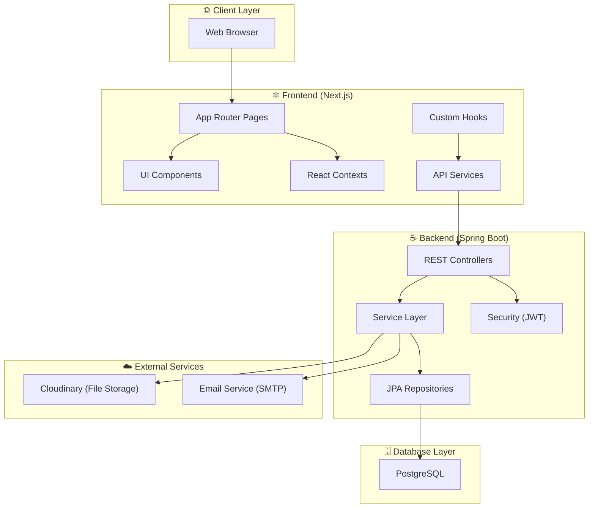
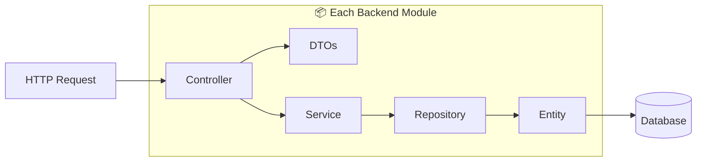
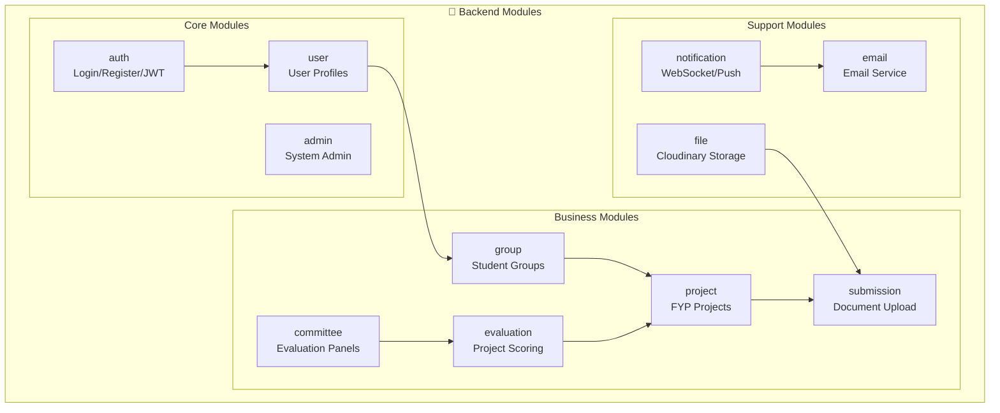
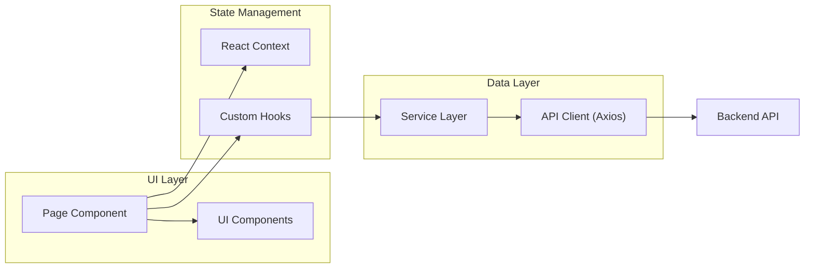
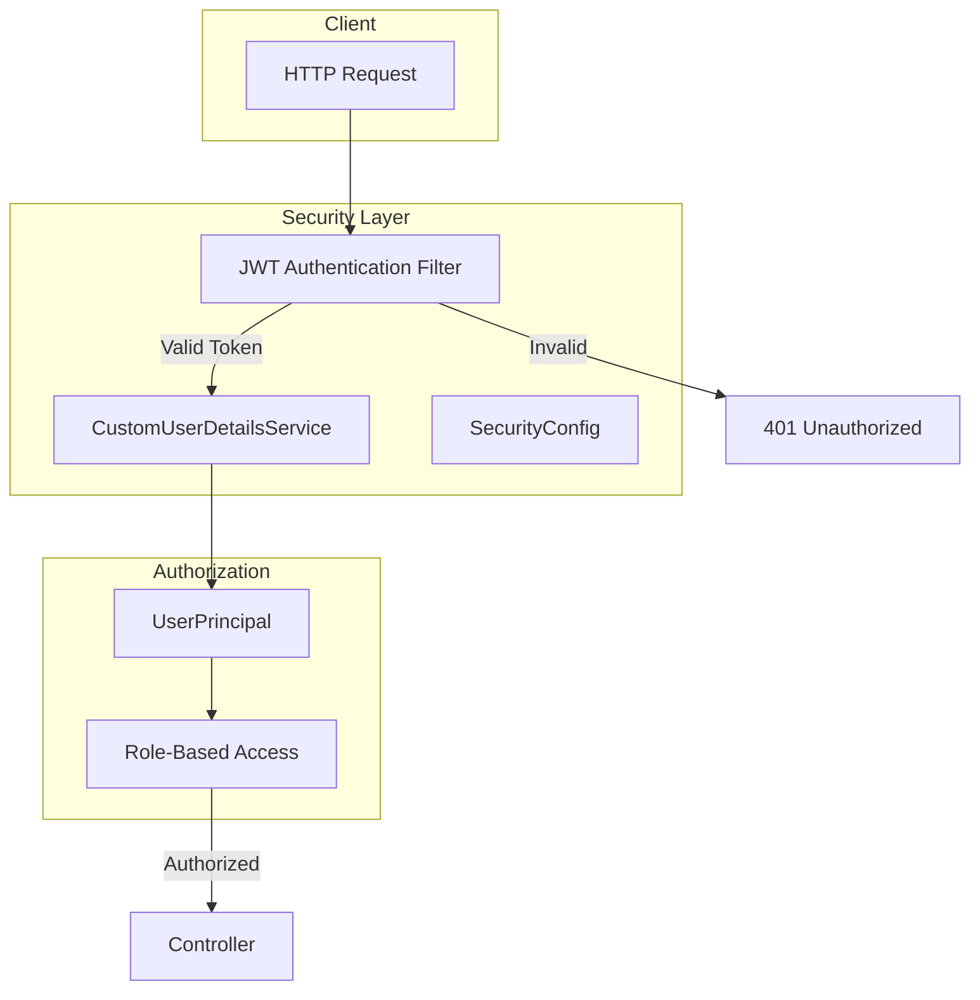
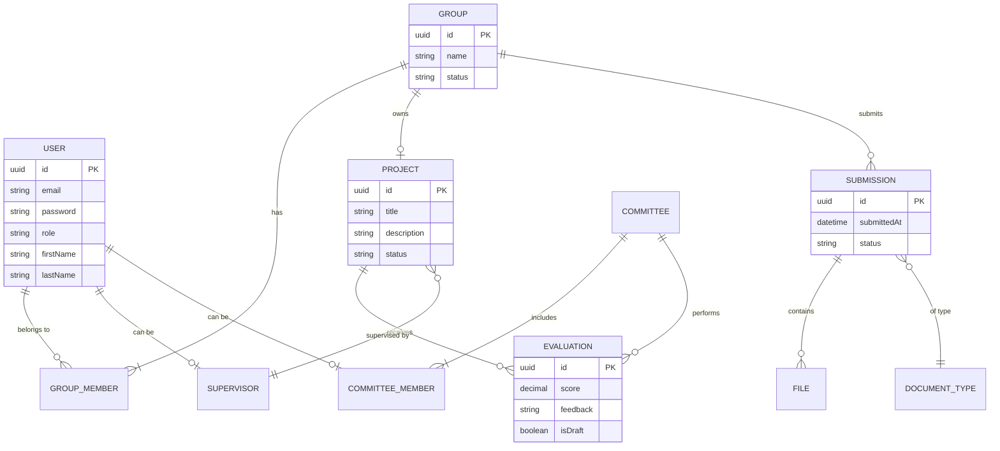
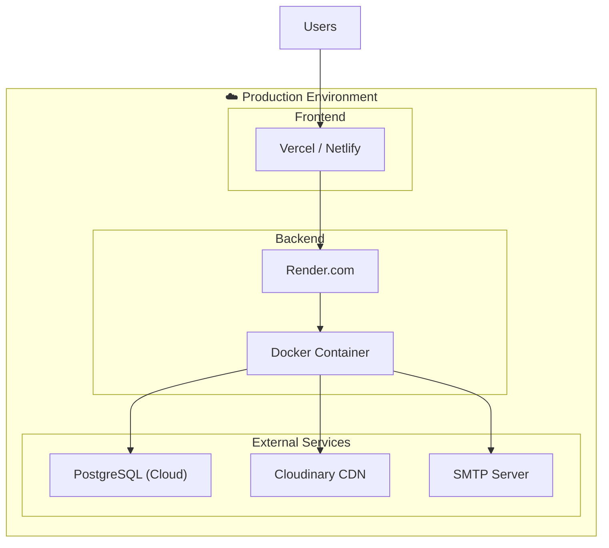

# FYPify - Detailed Architecture Diagram

## Project Overview

**FYPify** is a Final Year Project (FYP) Management System that enables universities to manage student projects, committee evaluations, and academic workflows. The application follows a modern full-stack architecture with a Spring Boot backend and Next.js frontend.

---

## High-Level System Architecture



---

## Backend Architecture (Spring Boot)

### Package Structure

```
backend/src/main/java/com/fypify/backend/
├── BackendApplication.java          # Main entry point
├── common/                           # Shared utilities
│   ├── controller/                   # Base controller
│   ├── exception/                    # Global exception handling
│   └── response/                     # API response DTOs
├── config/                           # Configuration classes
│   ├── AsyncConfig.java              # Async processing
│   ├── CloudinaryConfig.java         # File upload config
│   ├── DataSeeder.java               # Initial data setup
│   ├── OpenApiConfig.java            # Swagger/OpenAPI
│   ├── SecurityConfig.java           # Security configuration
│   └── WebSocketConfig.java          # Real-time notifications
├── security/                         # Security layer
│   ├── CustomUserDetailsService.java
│   ├── SecurityService.java
│   ├── UserPrincipal.java
│   └── jwt/                          # JWT token handling
└── modules/                          # Feature modules
    ├── admin/                        # Admin management
    ├── auth/                         # Authentication
    ├── committee/                    # Committee operations
    ├── email/                        # Email notifications
    ├── evaluation/                   # Project evaluation
    ├── file/                         # File management
    ├── group/                        # Student groups
    ├── notification/                 # Notifications
    ├── project/                      # Project management
    ├── submission/                   # Document submissions
    └── user/                         # User management
```

### Module Layered Architecture



### Backend Modules Detail



---

## Frontend Architecture (Next.js)

### Directory Structure

```
frontend/
├── app/                              # Next.js App Router
│   ├── layout.tsx                    # Root layout
│   ├── page.tsx                      # Home page
│   ├── globals.css                   # Global styles
│   ├── admin/                        # Admin pages
│   │   ├── dashboard/
│   │   ├── users/
│   │   ├── committees/
│   │   ├── document-types/
│   │   ├── reports/
│   │   ├── settings/
│   │   └── audit-logs/
│   ├── student/                      # Student pages
│   │   ├── dashboard/
│   │   ├── group/
│   │   ├── project/
│   │   ├── submissions/
│   │   └── results/
│   ├── supervisor/                   # Supervisor pages
│   │   ├── dashboard/
│   │   ├── groups/
│   │   ├── proposals/
│   │   ├── submissions/
│   │   └── evaluation/
│   ├── committee/                    # Committee pages
│   │   ├── fyp/
│   │   └── eval/
│   ├── login/
│   ├── register/
│   ├── forgot-password/
│   └── reset-password/
├── components/                       # Reusable components
│   ├── ui/                           # 54 UI components (shadcn/ui)
│   ├── layout/                       # Layout components
│   ├── auth/                         # Auth components
│   ├── project/                      # Project components
│   ├── supervisor/                   # Supervisor components
│   └── submission/                   # Submission components
├── contexts/                         # React Contexts
│   ├── AuthContext.tsx               # Auth state
│   └── SystemSettingsContext.tsx     # App settings
├── shared/                           # Shared utilities
│   ├── api/                          # API client config
│   ├── services/                     # API service functions
│   ├── hooks/                        # Custom React hooks
│   ├── types/                        # TypeScript types
│   └── constants/                    # App constants
├── providers/                        # React providers
├── lib/                              # Utility libraries
└── public/                           # Static assets
```

### Role-Based Routing Architecture

```mermaid
flowchart TB
    subgraph Auth["🔐 Authentication"]
        Login["login/"]
        Register["register/"]
        ForgotPwd["forgot-password/"]
        ResetPwd["reset-password/"]
    end
    
    subgraph Admin["👑 Admin Role"]
        AD["admin/dashboard"]
        AU["admin/users"]
        AC["admin/committees"]
        ADT["admin/document-types"]
        AR["admin/reports"]
        AS["admin/settings"]
        AAL["admin/audit-logs"]
    end
    
    subgraph Student["🎓 Student Role"]
        SD["student/dashboard"]
        SG["student/group"]
        SP["student/project"]
        SS["student/submissions"]
        SR["student/results"]
    end
    
    subgraph Supervisor["👨‍🏫 Supervisor Role"]
        SVD["supervisor/dashboard"]
        SVG["supervisor/groups"]
        SVP["supervisor/proposals"]
        SVS["supervisor/submissions"]
        SVE["supervisor/evaluation"]
    end
    
    subgraph Committee["📋 Committee Role"]
        CF["committee/fyp"]
        CE["committee/eval"]
    end
    
    Login --> AD & SD & SVD & CF
```



### Frontend Data Flow



### Services & Hooks Mapping

| Service File | Hook File | Purpose |
|-------------|-----------|---------|
| `auth.service.ts` | `useAuth.ts` | Authentication & session |
| `admin.service.ts` | `useAdmin.ts` | Admin operations |
| `committee.service.ts` | `useCommittee.ts` | Committee management |
| `evaluation.service.ts` | `useEvaluation.ts` | Project evaluations |
| `file.service.ts` | `useFile.ts` | File upload/download |
| `group.service.ts` | `useGroup.ts` | Student groups |
| `notification.service.ts` | `useNotification.ts` | Notifications |
| `project.service.ts` | `useProject.ts` | Project CRUD |
| `submission.service.ts` | `useSubmission.ts` | Document submissions |

---

## Security Architecture



---

## Database Entity Relationships



---

## Complete Tech Stack

### Backend
| Technology | Purpose |
|------------|---------|
| **Java 17+** | Programming language |
| **Spring Boot 3.x** | Application framework |
| **Spring Security** | Authentication & authorization |
| **Spring Data JPA** | Database ORM |
| **PostgreSQL** | Relational database |
| **JWT** | Token-based authentication |
| **Cloudinary** | Cloud file storage |
| **WebSocket** | Real-time notifications |
| **Maven** | Build tool |
| **Docker** | Containerization |

### Frontend
| Technology | Purpose |
|------------|---------|
| **Next.js 14+** | React framework (App Router) |
| **TypeScript** | Type-safe JavaScript |
| **React 18** | UI library |
| **TailwindCSS** | Utility-first CSS |
| **shadcn/ui** | UI component library |
| **Axios** | HTTP client |
| **React Hook Form** | Form handling |
| **React Query** | Server state management |

---

## Deployment Architecture



---

## Summary

The **FYPify** system follows a clean, modular architecture:

1. **Backend**: Spring Boot with modular package structure following Controller → Service → Repository pattern
2. **Frontend**: Next.js with App Router, role-based routing, and shared services/hooks pattern
3. **Security**: JWT-based authentication with role-based access control
4. **External Services**: Cloudinary for file storage, WebSocket for real-time features
5. **Database**: PostgreSQL with JPA/Hibernate ORM

The application supports four primary user roles: **Admin**, **Student**, **Supervisor**, and **Committee Member**, each with dedicated pages and functionalities.
