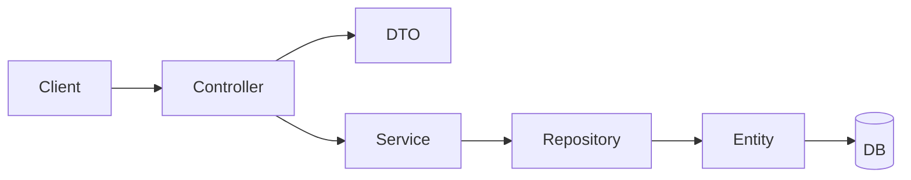

# FYPify Backend - Design Patterns Used

This document explains the **Gang of Four (GoF) Design Patterns** implemented in the FYPify backend with references to specific files.

---

## Pattern Summary

| Pattern | Type | Location |
|---------|------|----------|
| Singleton | Creational | All `@Service`, `@Component`, `@Configuration` classes |
| Builder | Creational | DTOs, ApiResponse, Entity classes |
| Factory Method | Creational | ApiResponse, Exception classes |
| Template Method | Behavioral | OncePerRequestFilter, Exception handlers |
| Chain of Responsibility | Behavioral | Security Filters, Exception Handlers |
| Strategy | Behavioral | Authentication, Password Encoding |
| Adapter | Structural | Exception to ApiResponse conversion |
| Repository | Architectural | All Repository interfaces |
| DTO (Data Transfer Object) | Architectural | All DTO classes |

---

## 1. Singleton Pattern (Creational)

**Purpose**: Ensure a class has only one instance and provide global access to it.

**Where Used**: Spring's IoC container manages all beans as singletons by default.

### Files Using This Pattern:

| File | Path |
|------|------|
| SecurityConfig | [SecurityConfig.java](file:///d:/University-Work/Semester%20No%205/SCD/Labs/Project/Project/backend/src/main/java/com/fypify/backend/config/SecurityConfig.java) |
| JwtAuthenticationFilter | [JwtAuthenticationFilter.java](file:///d:/University-Work/Semester%20No%205/SCD/Labs/Project/Project/backend/src/main/java/com/fypify/backend/security/jwt/JwtAuthenticationFilter.java) |
| GlobalExceptionHandler | [GlobalExceptionHandler.java](file:///d:/University-Work/Semester%20No%205/SCD/Labs/Project/Project/backend/src/main/java/com/fypify/backend/common/exception/GlobalExceptionHandler.java) |
| UserService | [UserService.java](file:///d:/University-Work/Semester%20No%205/SCD/Labs/Project/Project/backend/src/main/java/com/fypify/backend/modules/user/service/UserService.java) |

### How It Works:
```java
@Service  // Spring creates single instance
@RequiredArgsConstructor
public class UserService {
    private final UserRepository userRepository;
    // ...
}
```

---

## 2. Builder Pattern (Creational)

**Purpose**: Construct complex objects step by step, separating construction from representation.

**Where Used**: Entity creation, DTO construction, API responses.

### Files Using This Pattern:

| File | Path |
|------|------|
| ApiResponse | [ApiResponse.java](file:///d:/University-Work/Semester%20No%205/SCD/Labs/Project/Project/backend/src/main/java/com/fypify/backend/common/response/ApiResponse.java) |
| ApiError | [ApiError.java](file:///d:/University-Work/Semester%20No%205/SCD/Labs/Project/Project/backend/src/main/java/com/fypify/backend/common/response/ApiError.java) |
| SecurityConfig | [SecurityConfig.java](file:///d:/University-Work/Semester%20No%205/SCD/Labs/Project/Project/backend/src/main/java/com/fypify/backend/config/SecurityConfig.java) |
| UserService | [UserService.java](file:///d:/University-Work/Semester%20No%205/SCD/Labs/Project/Project/backend/src/main/java/com/fypify/backend/modules/user/service/UserService.java) |

### How It Works:
```java
// Entity creation with builder
User user = User.builder()
        .fullName(request.getFullName())
        .email(request.getEmail())
        .passwordHash(passwordEncoder.encode(request.getPassword()))
        .role(role)
        .isActive(true)
        .build();

// SecurityFilterChain builder (SecurityConfig.java)
http.csrf(csrf -> csrf.disable())
    .cors(cors -> cors.configurationSource(corsConfigurationSource()))
    .sessionManagement(session -> session.sessionCreationPolicy(STATELESS))
    .build();
```

---

## 3. Factory Method Pattern (Creational)

**Purpose**: Define an interface for creating objects, letting subclasses decide which class to instantiate.

**Where Used**: Static factory methods for creating API responses and exceptions.

### Files Using This Pattern:

| File | Path |
|------|------|
| ApiResponse | [ApiResponse.java](file:///d:/University-Work/Semester%20No%205/SCD/Labs/Project/Project/backend/src/main/java/com/fypify/backend/common/response/ApiResponse.java) |
| BaseException | [BaseException.java](file:///d:/University-Work/Semester%20No%205/SCD/Labs/Project/Project/backend/src/main/java/com/fypify/backend/common/exception/BaseException.java) |

### How It Works:
```java
// Factory methods in ApiResponse
public static <T> ApiResponse<T> success(T data) {
    return ApiResponse.<T>builder()
            .success(true)
            .data(data)
            .build();
}

public static <T> ApiResponse<T> error(String code, String message) {
    return ApiResponse.<T>builder()
            .success(false)
            .error(ApiError.builder().code(code).message(message).build())
            .build();
}
```

---

## 4. Template Method Pattern (Behavioral)

**Purpose**: Define the skeleton of an algorithm, deferring specific steps to subclasses.

**Where Used**: Security filters extending `OncePerRequestFilter`, exception hierarchy.

### Files Using This Pattern:

| File | Path |
|------|------|
| JwtAuthenticationFilter | [JwtAuthenticationFilter.java](file:///d:/University-Work/Semester%20No%205/SCD/Labs/Project/Project/backend/src/main/java/com/fypify/backend/security/jwt/JwtAuthenticationFilter.java) |
| BaseException | [BaseException.java](file:///d:/University-Work/Semester%20No%205/SCD/Labs/Project/Project/backend/src/main/java/com/fypify/backend/common/exception/BaseException.java) |
| GlobalExceptionHandler | [GlobalExceptionHandler.java](file:///d:/University-Work/Semester%20No%205/SCD/Labs/Project/Project/backend/src/main/java/com/fypify/backend/common/exception/GlobalExceptionHandler.java) |

### How It Works:
```java
// JwtAuthenticationFilter extends OncePerRequestFilter
// Parent class provides template, we override the hook method
public class JwtAuthenticationFilter extends OncePerRequestFilter {
    @Override
    protected void doFilterInternal(
            HttpServletRequest request,
            HttpServletResponse response,
            FilterChain filterChain
    ) throws ServletException, IOException {
        // Custom JWT logic here
        filterChain.doFilter(request, response);
    }
}
```

---

## 5. Chain of Responsibility Pattern (Behavioral)

**Purpose**: Pass requests along a chain of handlers, where each handler decides to process or pass to the next.

**Where Used**: Spring Security filter chain, exception handler chain.

### Files Using This Pattern:

| File | Path |
|------|------|
| SecurityConfig | [SecurityConfig.java](file:///d:/University-Work/Semester%20No%205/SCD/Labs/Project/Project/backend/src/main/java/com/fypify/backend/config/SecurityConfig.java) |
| JwtAuthenticationFilter | [JwtAuthenticationFilter.java](file:///d:/University-Work/Semester%20No%205/SCD/Labs/Project/Project/backend/src/main/java/com/fypify/backend/security/jwt/JwtAuthenticationFilter.java) |
| GlobalExceptionHandler | [GlobalExceptionHandler.java](file:///d:/University-Work/Semester%20No%205/SCD/Labs/Project/Project/backend/src/main/java/com/fypify/backend/common/exception/GlobalExceptionHandler.java) |

### How It Works:
```java
// Security Filter Chain
http.addFilterBefore(jwtAuthenticationFilter, UsernamePasswordAuthenticationFilter.class);

// Exception Handler Chain - handlers tried in order of specificity
@ExceptionHandler(ResourceNotFoundException.class)  // Most specific
public ResponseEntity<ApiResponse<Void>> handleResourceNotFound(...) { }

@ExceptionHandler(Exception.class)  // Fallback handler
public ResponseEntity<ApiResponse<Void>> handleGenericException(...) { }
```

---

## 6. Strategy Pattern (Behavioral)

**Purpose**: Define a family of algorithms, encapsulate each one, and make them interchangeable.

**Where Used**: Authentication providers, password encoding.

### Files Using This Pattern:

| File | Path |
|------|------|
| SecurityConfig | [SecurityConfig.java](file:///d:/University-Work/Semester%20No%205/SCD/Labs/Project/Project/backend/src/main/java/com/fypify/backend/config/SecurityConfig.java) |
| JwtTokenProvider | [JwtTokenProvider.java](file:///d:/University-Work/Semester%20No%205/SCD/Labs/Project/Project/backend/src/main/java/com/fypify/backend/security/jwt/JwtTokenProvider.java) |

### How It Works:
```java
// Password encoding strategy - can switch between BCrypt, Argon2, etc.
@Bean
public PasswordEncoder passwordEncoder() {
    return new BCryptPasswordEncoder();  // Strategy implementation
}

// Authentication provider strategy
@Bean
public AuthenticationProvider authenticationProvider() {
    DaoAuthenticationProvider provider = new DaoAuthenticationProvider();
    provider.setUserDetailsService(userDetailsService);
    provider.setPasswordEncoder(passwordEncoder());
    return provider;
}
```

---

## 7. Adapter Pattern (Structural)

**Purpose**: Convert the interface of a class into another interface clients expect.

**Where Used**: Converting exceptions to standardized API responses.

### Files Using This Pattern:

| File | Path |
|------|------|
| GlobalExceptionHandler | [GlobalExceptionHandler.java](file:///d:/University-Work/Semester%20No%205/SCD/Labs/Project/Project/backend/src/main/java/com/fypify/backend/common/exception/GlobalExceptionHandler.java) |

### How It Works:
```java
// Adapts various exception types to unified ApiResponse format
@ExceptionHandler(ResourceNotFoundException.class)
public ResponseEntity<ApiResponse<Void>> handleResourceNotFound(ResourceNotFoundException ex) {
    return ResponseEntity
            .status(HttpStatus.NOT_FOUND)
            .body(ApiResponse.error(ex.getErrorCode(), ex.getMessage()));
}

@ExceptionHandler(MethodArgumentNotValidException.class)
public ResponseEntity<ApiResponse<Void>> handleMethodArgumentNotValid(MethodArgumentNotValidException ex) {
    // Adapts Spring validation errors to our ApiError format
    ApiError apiError = ApiError.builder()
            .code("VALIDATION_ERROR")
            .message("Request validation failed")
            .details(errors)
            .build();
    return ResponseEntity.status(HttpStatus.BAD_REQUEST).body(ApiResponse.error(apiError));
}
```

---

## 8. Repository Pattern (Architectural)

**Purpose**: Mediate between domain and data mapping layers, acting like an in-memory collection.

**Where Used**: All data access operations via Spring Data JPA.

### Files Using This Pattern:

| Module | Repository Path |
|--------|-----------------|
| User | `modules/user/repository/UserRepository.java` |
| Group | `modules/group/repository/GroupRepository.java` |
| Project | `modules/project/repository/ProjectRepository.java` |
| Submission | `modules/submission/repository/SubmissionRepository.java` |
| Committee | `modules/committee/repository/CommitteeRepository.java` |
| Notification | `modules/notification/repository/NotificationRepository.java` |

### How It Works:
```java
public interface UserRepository extends JpaRepository<User, UUID> {
    Optional<User> findByEmail(String email);
    boolean existsByEmail(String email);
    List<User> findByRoleName(String roleName);
}
```

---

## 9. DTO Pattern (Data Transfer Object)

**Purpose**: Transfer data between layers without exposing domain entities.

**Where Used**: All API request/response objects.

### Module DTO Structure:
```
modules/
├── user/dto/
│   ├── UserDto.java
│   ├── CreateUserRequest.java
│   └── UpdateUserRequest.java
├── group/dto/
│   ├── GroupDto.java
│   └── CreateGroupRequest.java
├── project/dto/
│   ├── ProjectDto.java
│   └── CreateProjectRequest.java
└── ...
```

---

## Module Architecture Pattern

Each backend module follows a **Layered Architecture** pattern:

```
modules/{module-name}/
├── controller/    → REST API endpoints
├── dto/           → Request/Response objects
├── entity/        → JPA entities
├── repository/    → Data access interfaces
├── service/       → Business logic
└── package-info.java
```

### Data Flow:


---

## Pattern Categories Summary

### Creational Patterns
| Pattern | Purpose | Example File |
|---------|---------|--------------|
| Singleton | Single instance | `@Service`, `@Component` classes |
| Builder | Complex object construction | `ApiResponse`, Entity classes |
| Factory Method | Object creation encapsulation | `ApiResponse.success()` |

### Behavioral Patterns
| Pattern | Purpose | Example File |
|---------|---------|--------------|
| Chain of Responsibility | Request handling chain | Security Filters |
| Template Method | Algorithm skeleton | `OncePerRequestFilter` |
| Strategy | Interchangeable algorithms | PasswordEncoder |

### Structural Patterns
| Pattern | Purpose | Example File |
|---------|---------|--------------|
| Adapter | Interface conversion | GlobalExceptionHandler |

### Architectural Patterns
| Pattern | Purpose | Example |
|---------|---------|---------|
| Repository | Data access abstraction | JPA Repositories |
| DTO | Data transfer | Request/Response classes |
| Layered Architecture | Separation of concerns | Module structure |
